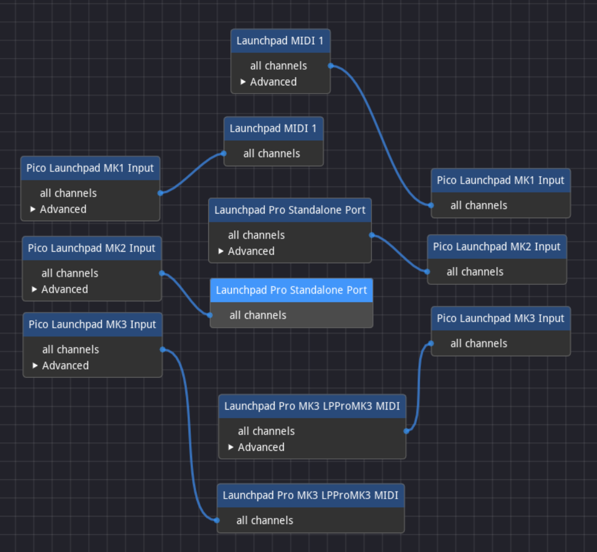

# Pico Launchpad

This project is meant as a starting point to create instruments and interfaces
using the Novation Launchpad family and a Raspberry Pi Pico (or Pico 2).

This project was cloned from [my template
repository](https://github.com/duhrer/pico-midi-transformer), see that project
for more technical details and background information on things like the
[TinyUSB](https://github.com/hathach/tinyusb) and [PIO
USB](https://github.com/sekigon-gonnoc/Pico-PIO-USB) libraries used here.

This project is the first where I've supported multiple virtual ports on a
single physical USB port, this is thanks to [this excellent
example](https://github.com/rppicomidi/midi-multistream2usbdev), which I adapted
for use here.

## Hardware Prerequisites

First, you'll need compatible hardware, which means a Pico or compatible
third-party unit. If your device has a second USB port, you can plug the
Launchpad directly into that. The "host" code in this project has mainly been
mainly tested with [a RP2350-based Waveshare
unit](https://www.waveshare.com/wiki/RP2350-USB-A), for anything else at a
minimum you'll need to adjust some ports in `pico-launchpad.c`.

## Software Prerequisites

Once you have something to run the code on, you'll need to set up a build
environment. In the past, I have used:

1. The [Getting Started with Pico Guide](https://datasheets.raspberrypi.org/pico/getting-started-with-pico.pdf)
2. The [Pico VS Code extension](https://github.com/raspberrypi/pico-vscode)

Both of those are probably the easiest starting points, and if you hit upon
questions, there are lots of people working with them, so hopefully you can find
the guidance you need.

Personally, I use [distrobox](https://distrobox.it/) and [the docker container
created by `lukstep`](https://github.com/lukstep/raspberry-pi-pico-docker-sdk),
which I set up using commands like:

```
distrobox-create --image lukstep/raspberry-pi-pico-sdk -n pico-sdk
distrobox enter pico-sdk
```

## Checking out the Code

This project uses [git
submodules](https://git-scm.com/book/en/v2/Git-Tools-Submodules) for the
libraries it relies on. This means that if you
[clone](https://git-scm.com/docs/git-clone) this repository, you won't have all
the code you need to successfully build binaries.

Although there are multiple ways to manage submodules, the simplest way to get
everything you need is to use a command like:

```
git clone --recurse-submodules https://github.com/duhrer/pico-midi-transformer.git
```

### Building

Before you build the code, you should check the pin settings in
`pico-launchpad.c` to confirm that they match your unit (there are commented out
sections for the tested boards mentioned above).

Once you have a working build environment and have updated your pin settings as
needed, you should be able to build the code in this project using commands
like:

```
mkdir -p build
cd build
cmake ..
make -j8
```

You should end up with binaries in various formats.

### Installing

The simplest way to install a binary is to boot the microcontroller into
`bootsel` mode. Hold down the `bootsel` button and plug your microcontroller
into USB. A USB drive will appear, and you can copy one the `.uf2` files
generated by the build process onto your unit. It will process and install the
binary if it can. If it doesn't do anything, make sure you're building for the
right processor family, and try other test binaries, like the examples that come
with [the Pico SDK](https://github.com/raspberrypi/pico-sdk).

If you're lucky enough to have a board with a reset button, all of the binaries
in this project also support entering `bootsel` mode by pressing the reset
button twice. You then copy the `pico-midi-transformer.uf2` file to the USB
drive as described above.

If you have a [pico probe](https://www.raspberrypi.com/products/debug-probe/) or
other debugging unit, and if your microcontroller exposes the ports you need,
you can use `openocd` to deploy binaries. With this method, you deploy one of
the `.elf` files generated during the build process. Check the "Getting Started
with Pico Guide" for more info.

### Running the Demo

#### Host Mode

If you have a compatible dual-USB unit, you should be able to connect the
Launchpad to your "host" port, and it should power on. Currently, I can't send
the sysex messages required to set up a Launchpad connected to the "host" port,
so you'll need to enter programmer mode on devices that support it.  On the
Launchpad Pro MK2, this is accomplished by holding down the setup button and
then hitting the orange pad in the top row of "modes".  On the Launchpad Pro
MK3, you need to hold the setup button in the lower left of the unit, use the
bottom row of controls to change to the "pad" menu, and then hit the bottom
right arrow to switch to programmer mode.  Check your user guide if you need
more help than that.

#### Client Mode

If you don't have a "host" port on your unit or want to connect more than one
Launchpad at a time, you'll need to connect things on the "client" side, i.e.
using code running on your computer. First, you need to connect both the
microcontroller and the Launchpad to your computer. You'll also need to
configure software like [midiconn](https://github.com/mfep/midiconn) to route
messages in both directions between the microcontroller and the Launchpad, as
shown here:



The key thing to note is that each generation has different ports that need to
be used. The first generation only has one input and output, those connect to
the MK1 input and output as shown above.  The Launchpad Pro MK2 has three inputs
and three outputs, the second of each set ("Standalone") is the one you need to
connoect to the MK2 input and output. The Launchpad Pro MK3 has multiple virtual
ports, but you only need to connect the first in each set (the one labelled
"MIDI").

Once everything is connected, you should see a "cross" of lit pads on connected
Launchpads. You can use the circular "arrow" pads at the top of the Launchpad to
move the cross around.


